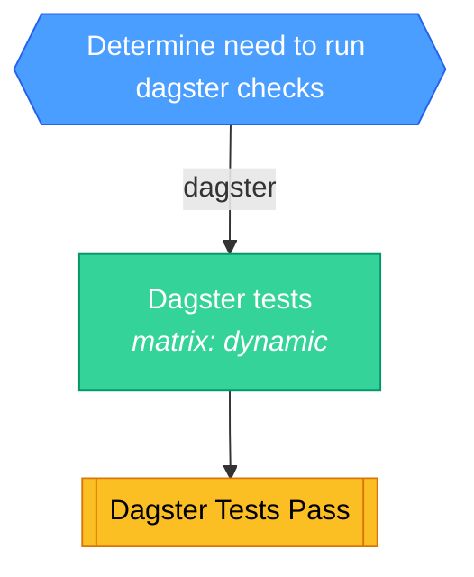

<!-- This file is auto-generated by bin/generate-ci-diagrams.py. Do not edit manually. -->

# Dagster CI (`ci-dagster.yml`)

**Triggers**: `pull_request`, `push`

## Legend

| Shape        | Color  | Meaning                   |
| ------------ | ------ | ------------------------- |
| Hexagon      | Blue   | Gate / change detection   |
| Stadium      | Purple | Plumbing / matrix builder |
| Rectangle    | Green  | Test / core work          |
| Subroutine   | Yellow | Collation / status gate   |
| Rounded rect | Red    | Side effect / snapshots   |

Edge labels show the change-detection output that gates the job.

## Job details

| Job             | Depends on | Condition | Matrix  |
| --------------- | ---------- | --------- | ------- |
| `changes`       | -          | -         | -       |
| `dagster`       | changes    | dagster   | dynamic |
| `dagster_tests` | dagster    | -         | -       |
