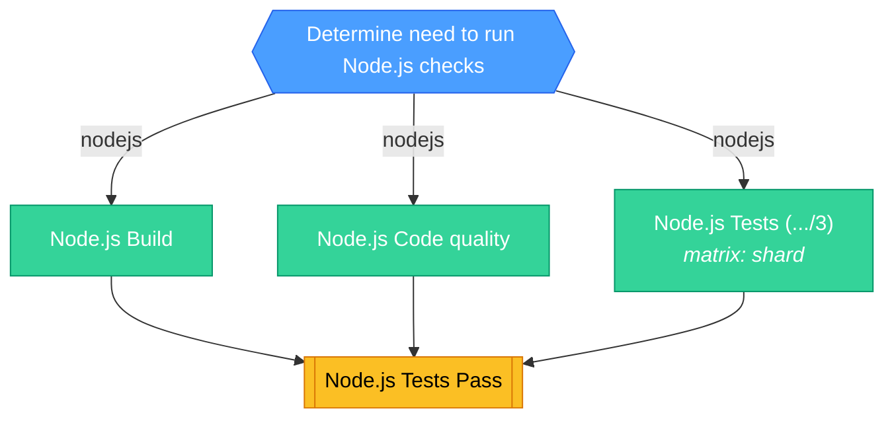

<!-- This file is auto-generated by bin/generate-ci-diagrams.py. Do not edit manually. -->

# Node.js CI (`ci-nodejs.yml`)

**Triggers**: `merge_group`, `pull_request`, `push`

## Legend

| Shape        | Color  | Meaning                   |
| ------------ | ------ | ------------------------- |
| Hexagon      | Blue   | Gate / change detection   |
| Stadium      | Purple | Plumbing / matrix builder |
| Rectangle    | Green  | Test / core work          |
| Subroutine   | Yellow | Collation / status gate   |
| Rounded rect | Red    | Side effect / snapshots   |

Edge labels show the change-detection output that gates the job.

## Job details

| Job          | Depends on         | Condition | Matrix |
| ------------ | ------------------ | --------- | ------ |
| `changes`    | -                  | -         | -      |
| `build`      | changes            | nodejs    | -      |
| `lint`       | changes            | nodejs    | -      |
| `tests`      | changes            | nodejs    | shard  |
| `node_tests` | tests, build, lint | -         | -      |
