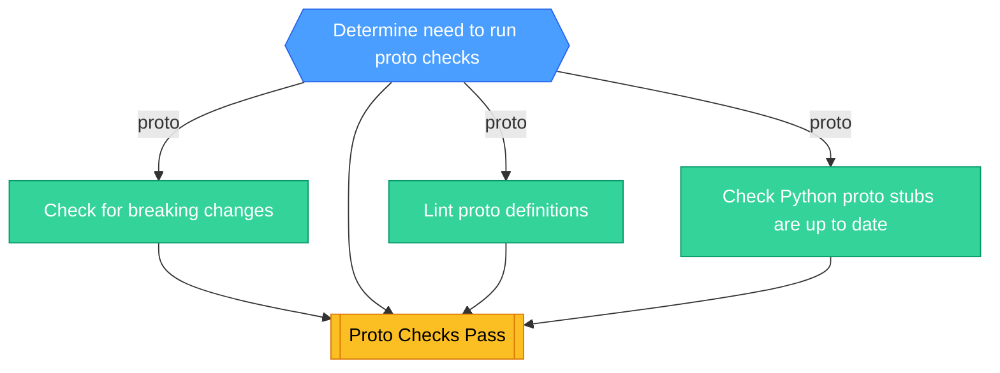

<!-- This file is auto-generated by bin/generate-ci-diagrams.py. Do not edit manually. -->

# Proto CI (`ci-proto.yml`)

**Triggers**: `merge_group`, `pull_request`, `push`, `workflow_dispatch`

## Legend

| Shape        | Color  | Meaning                   |
| ------------ | ------ | ------------------------- |
| Hexagon      | Blue   | Gate / change detection   |
| Stadium      | Purple | Plumbing / matrix builder |
| Rectangle    | Green  | Test / core work          |
| Subroutine   | Yellow | Collation / status gate   |
| Rounded rect | Red    | Side effect / snapshots   |

Edge labels show the change-detection output that gates the job.

## Job details

| Job              | Depends on                              | Condition                              | Matrix |
| ---------------- | --------------------------------------- | -------------------------------------- | ------ |
| `changes`        | -                                       | github.repository == 'PostHog/posthog' | -      |
| `breaking`       | changes                                 | proto                                  | -      |
| `lint`           | changes                                 | proto                                  | -      |
| `python-codegen` | changes                                 | proto                                  | -      |
| `proto_checks`   | changes, lint, breaking, python-codegen | -                                      | -      |
