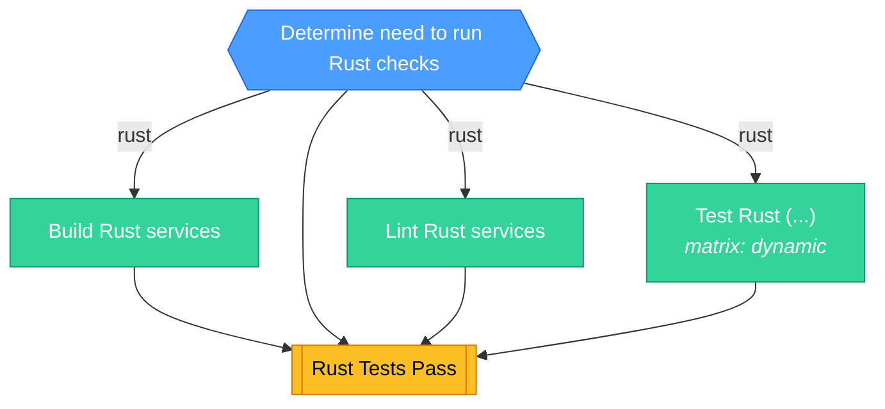

<!-- This file is auto-generated by bin/generate-ci-diagrams.py. Do not edit manually. -->

# Rust CI (`ci-rust.yml`)

**Triggers**: `merge_group`, `pull_request`, `push`, `workflow_dispatch`

## Legend

| Shape        | Color  | Meaning                   |
| ------------ | ------ | ------------------------- |
| Hexagon      | Blue   | Gate / change detection   |
| Stadium      | Purple | Plumbing / matrix builder |
| Rectangle    | Green  | Test / core work          |
| Subroutine   | Yellow | Collation / status gate   |
| Rounded rect | Red    | Side effect / snapshots   |

Edge labels show the change-detection output that gates the job.

## Job details

| Job          | Depends on                    | Condition                              | Matrix  |
| ------------ | ----------------------------- | -------------------------------------- | ------- |
| `changes`    | -                             | github.repository == 'PostHog/posthog' | -       |
| `build`      | changes                       | rust                                   | -       |
| `linting`    | changes                       | rust                                   | -       |
| `test`       | changes                       | rust                                   | dynamic |
| `rust_tests` | changes, build, test, linting | -                                      | -       |
