<!-- This file is auto-generated by bin/generate-ci-diagrams.py. Do not edit manually. -->

# Security (`ci-security.yaml`)

**Triggers**: `merge_group`, `pull_request`, `push`

```mermaid
graph TD
    classDef gate fill:#4a9eff,stroke:#2563eb,color:#fff
    classDef plumbing fill:#a78bfa,stroke:#7c3aed,color:#fff
    classDef test fill:#34d399,stroke:#059669,color:#fff
    classDef collation fill:#fbbf24,stroke:#d97706,color:#000
    classDef sideeffect fill:#f87171,stroke:#dc2626,color:#fff

    ensure-pinned-actions["ensure-pinned-actions"]
    semgrep-general["semgrep-general"]
    semgrep-go["semgrep-go"]
    semgrep-js["semgrep-js"]
    semgrep-python["semgrep-python"]
    semgrep-rust["semgrep-rust"]
    semgrep-test-rules["semgrep-test-rules"]
    semgrep_checks[["Semgrep Checks Pass"]]

    semgrep-general --> semgrep_checks
    semgrep-go --> semgrep_checks
    semgrep-js --> semgrep_checks
    semgrep-python --> semgrep_checks
    semgrep-rust --> semgrep_checks
    semgrep-test-rules --> semgrep_checks

    class ensure-pinned-actions test
    class semgrep-general test
    class semgrep-go test
    class semgrep-js test
    class semgrep-python test
    class semgrep-rust test
    class semgrep-test-rules test
    class semgrep_checks collation
```

## Legend

| Shape        | Color  | Meaning                   |
| ------------ | ------ | ------------------------- |
| Hexagon      | Blue   | Gate / change detection   |
| Stadium      | Purple | Plumbing / matrix builder |
| Rectangle    | Green  | Test / core work          |
| Subroutine   | Yellow | Collation / status gate   |
| Rounded rect | Red    | Side effect / snapshots   |

Edge labels show the change-detection output that gates the job.

## Job details

| Job                     | Depends on                                                                                | Condition | Matrix |
| ----------------------- | ----------------------------------------------------------------------------------------- | --------- | ------ |
| `ensure-pinned-actions` | -                                                                                         | -         | -      |
| `semgrep-general`       | -                                                                                         | -         | -      |
| `semgrep-go`            | -                                                                                         | -         | -      |
| `semgrep-js`            | -                                                                                         | -         | -      |
| `semgrep-python`        | -                                                                                         | -         | -      |
| `semgrep-rust`          | -                                                                                         | -         | -      |
| `semgrep-test-rules`    | -                                                                                         | -         | -      |
| `semgrep_checks`        | semgrep-python, semgrep-go, semgrep-rust, semgrep-js, semgrep-general, semgrep-test-rules | -         | -      |
